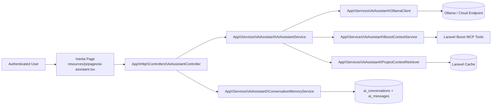
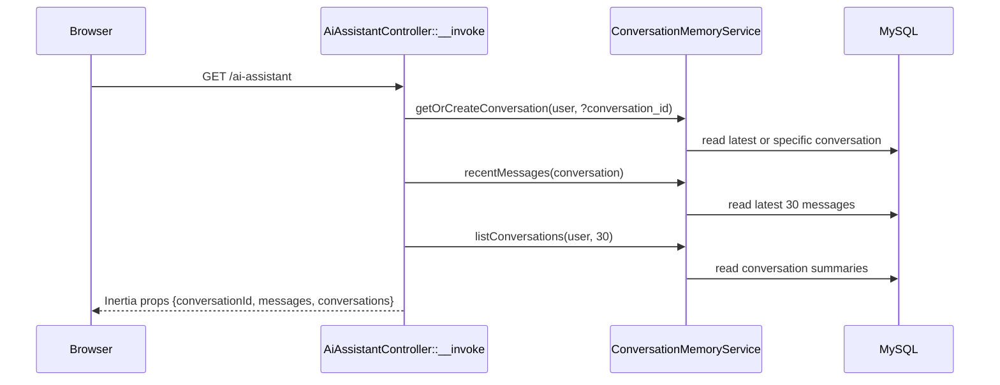
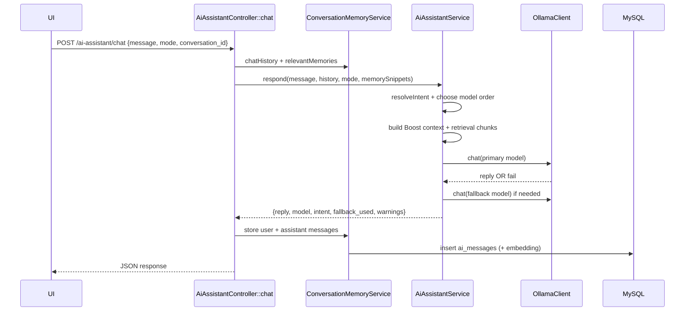
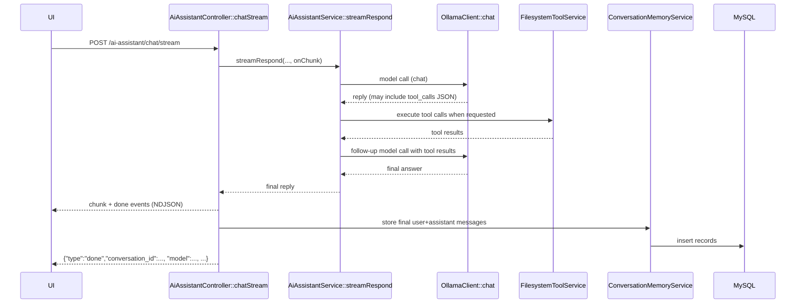

# AI Assistant Setup (Current State)

This project is a Laravel + Inertia AI assistant with:
- authenticated chat UI at `/ai-assistant`
- conversation persistence in MySQL
- model routing (planning vs coding)
- deep mode (plan then execute)
- streaming responses for both Fast and Deep modes over `/ai-assistant/chat/stream`
- live stream status trail and live tool activity feed in the UI
- optional Laravel Boost context injection
- embedding-based retrieval and conversation memory snippets
- filesystem tools for read/write/edit/append/create/list operations
- code search tool for symbol/usage discovery
- optional shell tool (`run_shell`) with configurable command restrictions
- optional Tavily-backed web search tool (`web_search`) with domain restrictions and citation-required responses
- enforced TypeScript quality gate for coding/CRUD responses
- canonical page template reference support for CRUD/page generation

## High-level architecture

## Request/response flows

### 1) Page load and sidebar conversations

### 2) Non-stream path (legacy/fallback endpoint)

### 3) Stream path (current primary path for Fast + Deep)

### 4) Deep mode internals

Deep mode runs two model passes inside `AiAssistantService::respondInDeepMode`:
1. Planning stage (`planning` model first, coding fallback)
2. Execution stage (`coding` model first, planning fallback), with the plan injected into execution prompt

Both stages share Boost/retrieval/memory context.

## Thinking, reasoning, model and tool-call lifecycle

This section describes the exact runtime process the assistant follows per request.

### Stage 1: Mode + intent decision
- Request mode is one of: `auto`, `planning`, `coding`, `deep`.
- In `auto`, the service infers intent from message content and recent history.
- Continuation prompts (`continue`, `go on`, etc.) infer intent from prior conversation context.

### Stage 2: Context assembly
- Build base system prompt with workflow rules and routing policy.
- Optionally add:
  - Laravel Boost context (application info/routes/artisan commands),
  - retrieval chunks from embedding search,
  - relevant memory snippets from conversation history,
  - canonical page template reference for CRUD/page generation.

### Stage 3: Model routing
- Planning-first path prefers `AI_ASSISTANT_MODEL_PLANNING`.
- Coding-first path prefers `AI_ASSISTANT_MODEL_CODING`.
- Fallback model is attempted automatically if primary fails.
- Deep mode does two passes:
  1. planning pass
  2. execution pass (with plan injected)

### Stage 4: Tool-call loop
- Model output is parsed for strict JSON `tool_calls`.
- Supported tools currently:
  - `read_file`, `write_file`, `edit`, `append_file`, `create_directory`, `list_directory`, `search_code`, `run_shell`, `web_search`
- If calls are present:
  - tools execute server-side,
  - structured tool results are appended back into the next model round.
- If malformed tool-call-like output is detected:
  - assistant asks model to retry with strict JSON only.
- If repeated identical tool payloads are detected:
  - assistant nudges model to issue alternative missing steps.
- For coding/CRUD flows, a TypeScript verification step runs before final answer (`npm run types` by default).
- If TypeScript verification fails, the assistant re-enters tool-calls to fix errors before finalizing.

### Stage 5: Stream telemetry (realtime)
- Controller emits NDJSON events to UI:
  - `heartbeat` (status phases),
  - `tool_activity` (requested calls/results),
  - `chunk` (assistant text delta),
  - `done` or `error`.
- UI renders:
  - elapsed time,
  - status trail,
  - live tool activity feed.
- Additional status phase appears during validation: `verifying_typescript`.

### Stage 6: Output cleanup + persistence
- Assistant sanitizes raw model output (removes raw tool JSON/thinking tags if present).
- User + assistant messages are stored in `ai_messages`.
- Conversation summaries/last-updated timestamps are refreshed.

## Routing and endpoints

Defined in `routes/web.php` under `auth` + `verified` middleware:
- `GET /ai-assistant` -> `AiAssistantController::__invoke`
- `POST /ai-assistant/conversations` -> `AiAssistantController::newConversation`
- `GET /ai-assistant/conversations/{conversation}` -> `AiAssistantController::showConversation`
- `POST /ai-assistant/chat` -> `AiAssistantController::chat`
- `POST /ai-assistant/chat/stream` -> `AiAssistantController::chatStream`

## Frontend behavior

Main UI file: `resources/js/pages/ai-assistant.tsx`

Current behavior:
- loads initial `conversationId`, `messages`, and `conversations` from Inertia props
- supports modes:
  - `Fast` (`mode=auto`)
  - `Deep` (`mode=deep`)
- sends NDJSON request to `/ai-assistant/chat/stream` for both fast and deep modes
- renders live status trail and tool execution feed while streaming
- assistant messages include a `Details` toggle; Deep mode can show planning content there, and optional thinking when enabled
- supports `New chat` button:
  - calls `POST /ai-assistant/conversations`
  - resets message list
  - switches active conversation id
- supports sidebar conversation switching:
  - calls `GET /ai-assistant/conversations/{id}`
  - loads historical messages into chat pane

Important note:
- Fast mode uses the stream endpoint, but tool calls are resolved server-side before final text is emitted to the UI, so users should not see raw `tool_calls` JSON.

UI elements currently not wired:
- `Attach`
- `Voice Message`

## Backend services

### `AiAssistantService`

Responsibilities:
- mode handling (`auto`, `planning`, `coding`, `deep`)
- intent routing in auto mode (`resolveIntent`)
- model fallback order
- tool-call loop for filesystem operations (when model returns tool JSON)
- prompt assembly with:
  - system policy and workflow skill text
  - optional Laravel Boost context
  - retrieved project chunks
  - relevant conversation memory snippets
  - execution plan (in deep mode)

Tool protocol (strict JSON from model):
- `{"tool_calls":[{"tool":"read_file","arguments":{"path":"app/Http/Controllers/Foo.php"}}]}`
- `{"tool_calls":[{"tool":"search_code","arguments":{"query":"AiAssistantController","path":"app"}}]}`
- Supported tools: `read_file`, `write_file`, `edit`, `append_file`, `create_directory`, `list_directory`, `search_code`, `run_shell`, `web_search`
- The assistant executes tool calls and feeds results back to the model for final response.

Returns payload including:
- `reply`
- `model`
- `intent`
- `fallback_used`
- optional `plan`, `plan_model`
- `warnings`
- `context` with `boost` and retrieval chunk count

### `ConversationMemoryService`

Responsibilities:
- get/create conversation for a user
- create brand new conversation (`New chat`)
- list conversation summaries for sidebar
- load recent messages
- build chat history window for model input
- compute relevant memory snippets with cosine similarity over stored message embeddings
- persist messages and per-message embeddings

### `FilesystemToolService`

Responsibilities:
- parse model tool-call JSON payloads
- execute filesystem operations
- enforce path policy from config (`allow_any_path` or restricted roots)
- enforce shell safety policy, including hard blocked command patterns

Supported tools:
- `read_file`
- `write_file`
- `edit`
- `append_file`
- `create_directory`
- `list_directory`
- `search_code`
- `run_shell`
- `web_search` (Tavily-backed; citation-required in final responses when used)

`search_code` arguments:
- `query` (string, required)
- `path` (string, optional, defaults to project root)
- `regex` (bool, optional, default false)
- `case_sensitive` (bool, optional, default false)

`web_search` arguments:
- `query` (string, required)
- `domains` (array|string, optional)
- `recency_days` (int, optional)
- `max_results` (int, optional)

Config keys:
- `AI_ASSISTANT_FS_TOOLS_ENABLED` (default `true`)
- `AI_ASSISTANT_FS_ALLOW_ANY_PATH` (default `true`)
- `AI_ASSISTANT_FS_ROOTS` (comma-separated)
- `AI_ASSISTANT_FS_MAX_READ_CHARS`
- `AI_ASSISTANT_FS_MAX_WRITE_CHARS`
- `AI_ASSISTANT_FS_MAX_TOOL_ROUNDS`
- `AI_ASSISTANT_FS_MAX_SEARCH_RESULTS`
- `AI_ASSISTANT_FS_MAX_SEARCH_FILE_BYTES`
- `AI_ASSISTANT_WEB_SEARCH_ENABLED`
- `AI_ASSISTANT_WEB_SEARCH_API_KEY`
- `AI_ASSISTANT_WEB_SEARCH_ALLOWED_DOMAINS`
- `AI_ASSISTANT_WEB_SEARCH_BLOCKED_DOMAINS`

Important behavior:
- `chatHistory` sends only the latest 20 messages to model input
- `AiAssistantService::buildMessages` further slices to last 12 safe history messages
- message writes update parent conversation timestamp via `AiMessage::$touches = ['conversation']`
- tool loop supports unbounded rounds when `AI_ASSISTANT_FS_MAX_TOOL_ROUNDS <= 0`
- loop emits live tool activity events (`tool_calls`, `tool_results`, bootstrap) to UI stream

### `ProjectContextRetriever`

Responsibilities:
- embed query
- read cached retrieval index
- rank cached chunks by cosine similarity
- return top `max_chunks`

Current state:
- retrieval index read path exists (`Cache::get`)
- warming/build pipeline is not invoked anywhere in runtime right now
- if cache is empty, assistant returns warning:
  - `Retrieval index is not warmed yet; skipped to keep responses fast.`

### `BoostContextService`

Responsibilities:
- check if Laravel Boost MCP executor exists
- execute tools:
  - Application Info
  - Route List
  - Artisan Commands
- concatenate tool outputs into context
- return warnings for missing/failed tools

## Ollama client behavior

`app/Services/AiAssistant/OllamaClient.php`:
- `chat()` -> `POST /api/chat` (`stream=false`)
- `streamChat()` -> streamed `POST /api/chat` (`stream=true`) and yields deltas line-by-line
- `embedding()`:
  - tries `POST /api/embed` first
  - falls back to legacy `POST /api/embeddings`

Configurable with:
- `AI_ASSISTANT_OLLAMA_BASE_URL`
- `AI_ASSISTANT_REQUEST_TIMEOUT`

Current runtime note:
- Tool-enabled assistant flows use chat + tool rounds for correctness.
- `streamChat()` exists and can still be used by future/alternate flows.

## Configuration

File: `config/ai-assistant.php`

Model config:
- `AI_ASSISTANT_MODEL_PLANNING` default `glm-5:cloud`
- `AI_ASSISTANT_MODEL_CODING` default `qwen3-coder-next:cloud`
- `AI_ASSISTANT_MODEL_EMBEDDING` default `qwen3-embedding:0.6b`

Retrieval config:
- `AI_ASSISTANT_MAX_CONTEXT_CHUNKS` default `4`
- `AI_ASSISTANT_MAX_INDEX_FILES` default `40`
- `AI_ASSISTANT_MAX_FILE_CHARS` default `2400`
- `AI_ASSISTANT_CHUNK_SIZE` default `900`
- `AI_ASSISTANT_CHUNK_OVERLAP` default `180`
- `AI_ASSISTANT_INDEX_CACHE_TTL` default `86400`
- retrieval scan paths:
  - `app`
  - `routes`
  - `config`
  - `resources/js/pages`

Filesystem tool config:
- `AI_ASSISTANT_FS_TOOLS_ENABLED` default `true`
- `AI_ASSISTANT_FS_ALLOW_ANY_PATH` default `true`
- `AI_ASSISTANT_FS_ROOTS` default `base_path()` (comma-separated when set)
- `AI_ASSISTANT_FS_MAX_READ_CHARS` default `200000`
- `AI_ASSISTANT_FS_MAX_WRITE_CHARS` default `400000`
- `AI_ASSISTANT_FS_MAX_TOOL_ROUNDS` default `16` (`<=0` means unbounded loop rounds)
- `AI_ASSISTANT_FS_MAX_SEARCH_RESULTS` default `60`
- `AI_ASSISTANT_FS_MAX_SEARCH_FILE_BYTES` default `300000`
- shell tool config:
  - `AI_ASSISTANT_FS_SHELL_ENABLED` default `false`
  - `AI_ASSISTANT_FS_SHELL_ALLOW_ANY_COMMAND` default `false`
  - `AI_ASSISTANT_FS_SHELL_ALLOWED_PREFIXES` (comma-separated prefixes)
  - `AI_ASSISTANT_FS_SHELL_BLOCKED_PATTERNS` (comma-separated hard blocklist; matched commands are always denied, even when `ALLOW_ANY_COMMAND=true`)
  - `AI_ASSISTANT_FS_SHELL_TIMEOUT_SECONDS` default `30`
  - `AI_ASSISTANT_FS_SHELL_MAX_OUTPUT_CHARS` default `12000`
- web search tool config:
  - `AI_ASSISTANT_WEB_SEARCH_ENABLED` default `false`
  - `AI_ASSISTANT_WEB_SEARCH_API_KEY` (required when enabled)
  - `AI_ASSISTANT_WEB_SEARCH_BASE_URL` default `https://api.tavily.com`
  - `AI_ASSISTANT_WEB_SEARCH_ENDPOINT` default `/search`
  - `AI_ASSISTANT_WEB_SEARCH_TIMEOUT_SECONDS` default `20`
  - `AI_ASSISTANT_WEB_SEARCH_MAX_RESULTS` default `5`
  - `AI_ASSISTANT_WEB_SEARCH_ALLOWED_DOMAINS` (comma-separated allowlist; optional)
  - `AI_ASSISTANT_WEB_SEARCH_BLOCKED_DOMAINS` (comma-separated denylist)
  - `AI_ASSISTANT_WEB_SEARCH_REQUIRE_CITATIONS` default `true`

Quality gate config:
- `AI_ASSISTANT_TS_CHECK_ON_CODING` default `true`
- `AI_ASSISTANT_TS_CHECK_COMMAND` default `npm run types -- --pretty false`
- `AI_ASSISTANT_TS_CHECK_TIMEOUT_SECONDS` default `120`
- `AI_ASSISTANT_TS_CHECK_MAX_OUTPUT_CHARS` default `24000`

UI config:
- `AI_ASSISTANT_UI_EXPOSE_THINKING` default `false` (when enabled, captured `<think>...</think>` content can be shown in the message details panel)

## Data model

### `ai_conversations`
- `id`
- `user_id` (FK `users.id`, cascade delete)
- `title` nullable
- timestamps

### `ai_messages`
- `id`
- `ai_conversation_id` (FK `ai_conversations.id`, cascade delete)
- `role` enum: `user | assistant`
- `content` longText
- `model` nullable
- `mode` nullable
- `stage` nullable
- `embedding` nullable longText (JSON vector)
- `meta` nullable JSON
- timestamps
- index on (`ai_conversation_id`, `created_at`)

## Validation and security

Request validation (`AiAssistantChatRequest`):
- `message` required string max 3000
- `mode` in `auto|planning|coding|deep`
- `conversation_id` nullable integer
- `history` optional array up to 20 entries

Access control:
- all assistant routes require authenticated and verified user
- `showConversation` enforces conversation ownership (`404` when not owner)

## Logging and observability

Controller logs:
- `ai-assistant.chat.request`
- `ai-assistant.chat.success`
- `ai-assistant.chat.failed`

Logged fields include:
- `user_id`
- `conversation_id`
- `message_length`
- `history_count`
- `memory_snippets_count`
- `mode`
- `duration_ms`
- `fallback_used`
- `stream` flag for stream path

## Operational checklist

1. Install dependencies
- `composer install`
- `npm install`

2. Configure env
- set database credentials
- set AI assistant env vars (or use defaults)
- ensure new filesystem/search tool env vars are present (already in `.env.example`)
- recommended for safer deployments:
  - `AI_ASSISTANT_FS_ALLOW_ANY_PATH=false`
  - `AI_ASSISTANT_FS_ROOTS=/home/maikol1/agentic-v.2,/tmp`

3. Migrate database
- `php artisan migrate`

4. Run app
- `php artisan serve`
- `npm run dev`

5. Optional cache cleanup after route/service changes
- `php artisan optimize:clear`

6. If you changed `.env`, clear cached config
- `php artisan optimize:clear`

## Known limitations (current code)

- Retrieval warm behavior is query-sensitive; short/simple prompts may skip lazy warm to reduce latency.
- Attachments and voice input buttons are UI-only placeholders.
- Automated tests for new conversation listing/switching are minimal compared to chat core behavior.
- `AI_ASSISTANT_FS_ALLOW_ANY_PATH=true` is very permissive; use restricted roots for safer deployments.
- Unbounded tool rounds (`AI_ASSISTANT_FS_MAX_TOOL_ROUNDS=0`) can run for a long time; keep request/model timeouts in mind.
- TypeScript quality gate improves reliability but can increase completion time for coding-heavy tasks.

## Current module state

- AI-generated `orders`, `products`, and `budgets` CRUD modules were removed from the app scaffold.
- Remaining documented routes/pages in this README refer to the AI assistant module and core starter-kit pages.

## Key files map

- Controller:
  - `app/Http/Controllers/AiAssistantController.php`
- Request:
  - `app/Http/Requests/AiAssistantChatRequest.php`
- Core services:
  - `app/Services/AiAssistant/AiAssistantService.php`
  - `app/Services/AiAssistant/FilesystemToolService.php`
  - `app/Services/AiAssistant/OllamaClient.php`
  - `app/Services/AiAssistant/BoostContextService.php`
  - `app/Services/AiAssistant/ProjectContextRetriever.php`
  - `app/Services/AiAssistant/ConversationMemoryService.php`
- Models:
  - `app/Models/AiConversation.php`
  - `app/Models/AiMessage.php`
- Routes:
  - `routes/web.php`
- Frontend page:
  - `resources/js/pages/ai-assistant.tsx`
- Page template reference:
  - `tasks/page-template-reference.md`
  - `tasks/import-pattern-reference.md`
  - `tasks/laravel-model-table-reference.md`
- Config:
  - `config/ai-assistant.php`
- Migrations:
  - `database/migrations/2026_02_28_000001_create_ai_conversations_table.php`
  - `database/migrations/2026_02_28_000002_create_ai_messages_table.php`

## Laravel MCP vs Boost (in this project)

- `laravel/mcp` is installed as protocol/server infrastructure.
- `laravel/boost` is installed and currently used for runtime context enrichment.
- Current architecture uses:
  - Boost MCP tools for context (`Application Info`, `Route List`, `Artisan Commands`) via `BoostContextService`.
  - Custom tool execution (`read_file`, `write_file`, `edit`, `append_file`, `create_directory`, `list_directory`, `search_code`, `run_shell`) via `FilesystemToolService`.
- A custom MCP server route is not currently part of the active flow (`routes/ai.php` example remains commented).

## UI component inventory (shadcn)

- Project uses shadcn components under `resources/js/components/ui`.
- The full current `registry:ui` component set has been added and type-checked successfully.
- Existing project-specific component APIs were preserved; compatibility fixes were applied where necessary.
- New dependencies were added to support the expanded shadcn component set (see `package.json` / `package-lock.json`).
