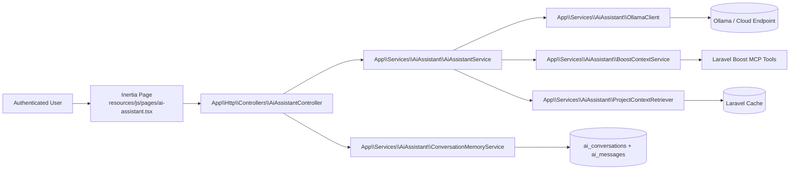
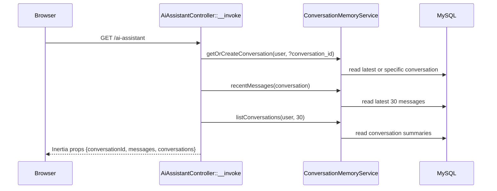
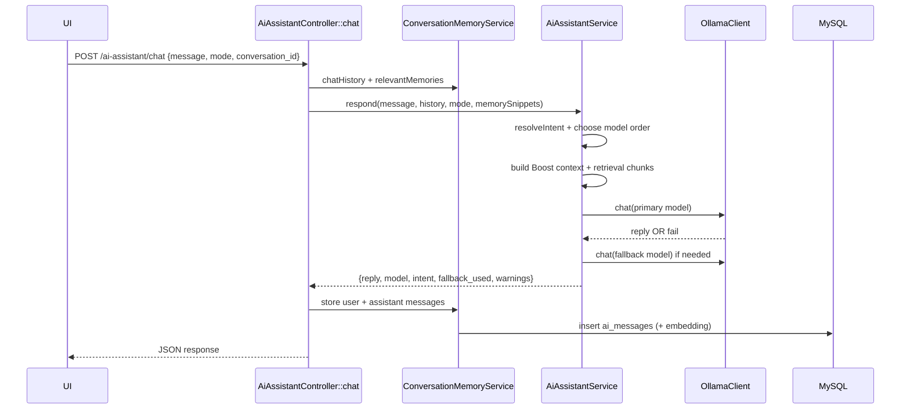
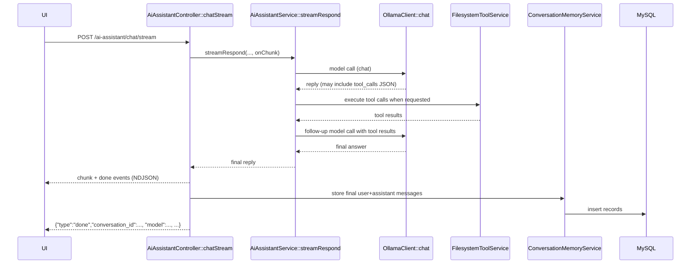

# AI Assistant Setup (Current State)

This project is a Laravel + Inertia AI assistant with:
- authenticated chat UI at `/ai-assistant`
- conversation persistence in MySQL
- model routing (planning vs coding)
- deep mode (plan then execute)
- fast mode over stream endpoint with tool-aware final output
- optional Laravel Boost context injection
- embedding-based retrieval and conversation memory snippets
- filesystem tools for read/write/append/create/list operations
- code search tool for symbol/usage discovery

## High-level architecture

## Request/response flows

### 1) Page load and sidebar conversations

### 2) Fast mode (auto/planning/coding), non-stream

### 3) Fast mode, stream path

### 4) Deep mode

Deep mode runs two model passes inside `AiAssistantService::respondInDeepMode`:
1. Planning stage (`planning` model first, coding fallback)
2. Execution stage (`coding` model first, planning fallback), with the plan injected into execution prompt

Both stages share Boost/retrieval/memory context.

## Routing and endpoints

Defined in `routes/web.php` under `auth` + `verified` middleware:
- `GET /ai-assistant` -> `AiAssistantController::__invoke`
- `POST /ai-assistant/conversations` -> `AiAssistantController::newConversation`
- `GET /ai-assistant/conversations/{conversation}` -> `AiAssistantController::showConversation`
- `POST /ai-assistant/chat` -> `AiAssistantController::chat`
- `POST /ai-assistant/chat/stream` -> `AiAssistantController::chatStream`

## Frontend behavior

Main UI file: `resources/js/pages/ai-assistant.tsx`

Current behavior:
- loads initial `conversationId`, `messages`, and `conversations` from Inertia props
- supports modes:
  - `Fast` (`mode=auto`)
  - `Deep` (`mode=deep`)
- sends JSON request to `/ai-assistant/chat` for deep mode
- sends NDJSON request to `/ai-assistant/chat/stream` for fast mode
- supports `New chat` button:
  - calls `POST /ai-assistant/conversations`
  - resets message list
  - switches active conversation id
- supports sidebar conversation switching:
  - calls `GET /ai-assistant/conversations/{id}`
  - loads historical messages into chat pane

Important note:
- Fast mode uses the stream endpoint, but tool calls are resolved server-side before final text is emitted to the UI, so users should not see raw `tool_calls` JSON.

UI elements currently not wired:
- `Attach`
- `Voice Message`

## Backend services

### `AiAssistantService`

Responsibilities:
- mode handling (`auto`, `planning`, `coding`, `deep`)
- intent routing in auto mode (`resolveIntent`)
- model fallback order
- tool-call loop for filesystem operations (when model returns tool JSON)
- prompt assembly with:
  - system policy and workflow skill text
  - optional Laravel Boost context
  - retrieved project chunks
  - relevant conversation memory snippets
  - execution plan (in deep mode)

Tool protocol (strict JSON from model):
- `{"tool_calls":[{"tool":"read_file","arguments":{"path":"app/Http/Controllers/Foo.php"}}]}`
- `{"tool_calls":[{"tool":"search_code","arguments":{"query":"AiAssistantController","path":"app"}}]}`
- Supported tools: `read_file`, `write_file`, `append_file`, `create_directory`, `list_directory`, `search_code`
- The assistant executes tool calls and feeds results back to the model for final response.

Returns payload including:
- `reply`
- `model`
- `intent`
- `fallback_used`
- optional `plan`, `plan_model`
- `warnings`
- `context` with `boost` and retrieval chunk count

### `ConversationMemoryService`

Responsibilities:
- get/create conversation for a user
- create brand new conversation (`New chat`)
- list conversation summaries for sidebar
- load recent messages
- build chat history window for model input
- compute relevant memory snippets with cosine similarity over stored message embeddings
- persist messages and per-message embeddings

### `FilesystemToolService`

Responsibilities:
- parse model tool-call JSON payloads
- execute filesystem operations
- enforce path policy from config (`allow_any_path` or restricted roots)

Supported tools:
- `read_file`
- `write_file`
- `append_file`
- `create_directory`
- `list_directory`
- `search_code`

`search_code` arguments:
- `query` (string, required)
- `path` (string, optional, defaults to project root)
- `regex` (bool, optional, default false)
- `case_sensitive` (bool, optional, default false)

Config keys:
- `AI_ASSISTANT_FS_TOOLS_ENABLED` (default `true`)
- `AI_ASSISTANT_FS_ALLOW_ANY_PATH` (default `true`)
- `AI_ASSISTANT_FS_ROOTS` (comma-separated)
- `AI_ASSISTANT_FS_MAX_READ_CHARS`
- `AI_ASSISTANT_FS_MAX_WRITE_CHARS`
- `AI_ASSISTANT_FS_MAX_TOOL_ROUNDS`
- `AI_ASSISTANT_FS_MAX_SEARCH_RESULTS`
- `AI_ASSISTANT_FS_MAX_SEARCH_FILE_BYTES`

Important behavior:
- `chatHistory` sends only the latest 20 messages to model input
- `AiAssistantService::buildMessages` further slices to last 8 safe history messages
- message writes update parent conversation timestamp via `AiMessage::$touches = ['conversation']`

### `ProjectContextRetriever`

Responsibilities:
- embed query
- read cached retrieval index
- rank cached chunks by cosine similarity
- return top `max_chunks`

Current state:
- retrieval index read path exists (`Cache::get`)
- warming/build pipeline is not invoked anywhere in runtime right now
- if cache is empty, assistant returns warning:
  - `Retrieval index is not warmed yet; skipped to keep responses fast.`

### `BoostContextService`

Responsibilities:
- check if Laravel Boost MCP executor exists
- execute tools:
  - Application Info
  - Route List
  - Artisan Commands
- concatenate tool outputs into context
- return warnings for missing/failed tools

## Ollama client behavior

`app/Services/AiAssistant/OllamaClient.php`:
- `chat()` -> `POST /api/chat` (`stream=false`)
- `streamChat()` -> streamed `POST /api/chat` (`stream=true`) and yields deltas line-by-line
- `embedding()`:
  - tries `POST /api/embed` first
  - falls back to legacy `POST /api/embeddings`

Configurable with:
- `AI_ASSISTANT_OLLAMA_BASE_URL`
- `AI_ASSISTANT_REQUEST_TIMEOUT`

Current runtime note:
- Tool-enabled assistant flows use chat + tool rounds for correctness.
- `streamChat()` exists and can still be used by future/alternate flows.

## Configuration

File: `config/ai-assistant.php`

Model config:
- `AI_ASSISTANT_MODEL_PLANNING` default `glm-5:cloud`
- `AI_ASSISTANT_MODEL_CODING` default `qwen3-coder-next:cloud`
- `AI_ASSISTANT_MODEL_EMBEDDING` default `qwen3-embedding:0.6b`

Retrieval config:
- `AI_ASSISTANT_MAX_CONTEXT_CHUNKS` default `4`
- `AI_ASSISTANT_MAX_INDEX_FILES` default `40`
- `AI_ASSISTANT_MAX_FILE_CHARS` default `2400`
- `AI_ASSISTANT_CHUNK_SIZE` default `900`
- `AI_ASSISTANT_CHUNK_OVERLAP` default `180`
- `AI_ASSISTANT_INDEX_CACHE_TTL` default `86400`
- retrieval scan paths:
  - `app`
  - `routes`
  - `config`
  - `resources/js/pages`

Filesystem tool config:
- `AI_ASSISTANT_FS_TOOLS_ENABLED` default `true`
- `AI_ASSISTANT_FS_ALLOW_ANY_PATH` default `true`
- `AI_ASSISTANT_FS_ROOTS` default `base_path()` (comma-separated when set)
- `AI_ASSISTANT_FS_MAX_READ_CHARS` default `200000`
- `AI_ASSISTANT_FS_MAX_WRITE_CHARS` default `400000`
- `AI_ASSISTANT_FS_MAX_TOOL_ROUNDS` default `4`
- `AI_ASSISTANT_FS_MAX_SEARCH_RESULTS` default `60`
- `AI_ASSISTANT_FS_MAX_SEARCH_FILE_BYTES` default `300000`

## Data model

### `ai_conversations`
- `id`
- `user_id` (FK `users.id`, cascade delete)
- `title` nullable
- timestamps

### `ai_messages`
- `id`
- `ai_conversation_id` (FK `ai_conversations.id`, cascade delete)
- `role` enum: `user | assistant`
- `content` longText
- `model` nullable
- `mode` nullable
- `stage` nullable
- `embedding` nullable longText (JSON vector)
- `meta` nullable JSON
- timestamps
- index on (`ai_conversation_id`, `created_at`)

## Validation and security

Request validation (`AiAssistantChatRequest`):
- `message` required string max 3000
- `mode` in `auto|planning|coding|deep`
- `conversation_id` nullable integer
- `history` optional array up to 20 entries

Access control:
- all assistant routes require authenticated and verified user
- `showConversation` enforces conversation ownership (`404` when not owner)

## Logging and observability

Controller logs:
- `ai-assistant.chat.request`
- `ai-assistant.chat.success`
- `ai-assistant.chat.failed`

Logged fields include:
- `user_id`
- `conversation_id`
- `message_length`
- `history_count`
- `memory_snippets_count`
- `mode`
- `duration_ms`
- `fallback_used`
- `stream` flag for stream path

## Operational checklist

1. Install dependencies
- `composer install`
- `npm install`

2. Configure env
- set database credentials
- set AI assistant env vars (or use defaults)
- ensure new filesystem/search tool env vars are present (already in `.env.example`)
- recommended for safer deployments:
  - `AI_ASSISTANT_FS_ALLOW_ANY_PATH=false`
  - `AI_ASSISTANT_FS_ROOTS=/home/maikol1/agentic-v.2,/tmp`

3. Migrate database
- `php artisan migrate`

4. Run app
- `php artisan serve`
- `npm run dev`

5. Optional cache cleanup after route/service changes
- `php artisan optimize:clear`

6. If you changed `.env`, clear cached config
- `php artisan optimize:clear`

## Known limitations (current code)

- Retrieval index warming is not wired in runtime, so project-chunk retrieval usually returns empty with warning until cache is populated by external process.
- Attachments and voice input buttons are UI-only placeholders.
- Automated tests for new conversation listing/switching are minimal compared to chat core behavior.
- `AI_ASSISTANT_FS_ALLOW_ANY_PATH=true` is very permissive; use restricted roots for safer deployments.

## Key files map

- Controller:
  - `app/Http/Controllers/AiAssistantController.php`
- Request:
  - `app/Http/Requests/AiAssistantChatRequest.php`
- Core services:
  - `app/Services/AiAssistant/AiAssistantService.php`
  - `app/Services/AiAssistant/FilesystemToolService.php`
  - `app/Services/AiAssistant/OllamaClient.php`
  - `app/Services/AiAssistant/BoostContextService.php`
  - `app/Services/AiAssistant/ProjectContextRetriever.php`
  - `app/Services/AiAssistant/ConversationMemoryService.php`
- Models:
  - `app/Models/AiConversation.php`
  - `app/Models/AiMessage.php`
- Routes:
  - `routes/web.php`
- Frontend page:
  - `resources/js/pages/ai-assistant.tsx`
- Config:
  - `config/ai-assistant.php`
- Migrations:
  - `database/migrations/2026_02_28_000001_create_ai_conversations_table.php`
  - `database/migrations/2026_02_28_000002_create_ai_messages_table.php`
